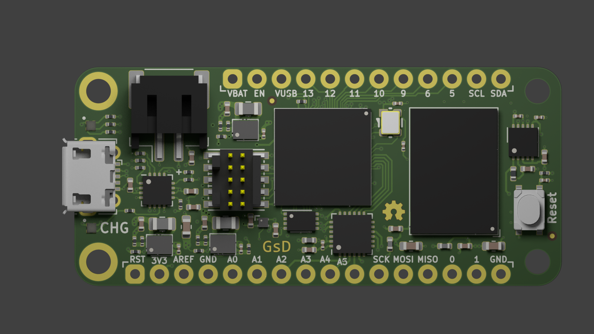
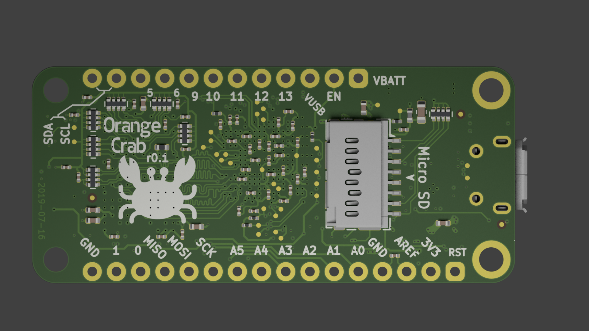

# Orange Crab

## ECP5 DDR3 memory in a Feather form-factor.

	Project status: Still in Development (Use stuff here if you want, but there is no support.)

## Hardware

* Lattice ECP5 25/45/85 variants
* 1x DDR3 Memory upto 8Gbit (x16)
* Micro USB connection
* Full-speed direct USB connection to FPGA
* Battery charger
* Reset Button 
* 128Mbit QSPI FLASH Memory (Bitstream + User storage)
* 4bit MicroSD socket
* 48MHz Oscillator
* All extra I/O's broken out onto a 30pin header
  * 7 diff pairs
  * 1 single ended only

