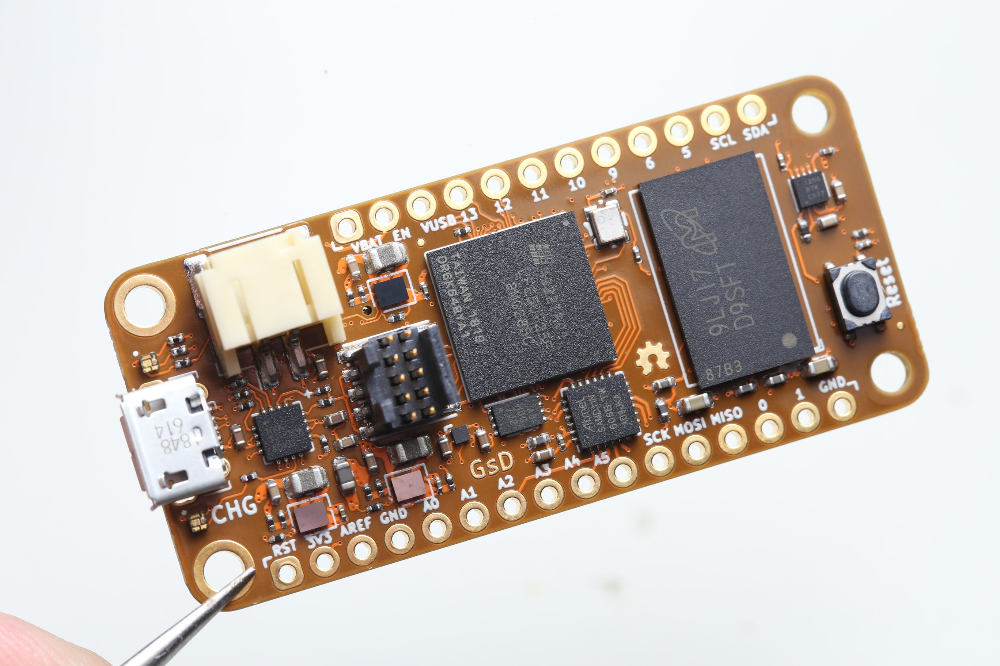
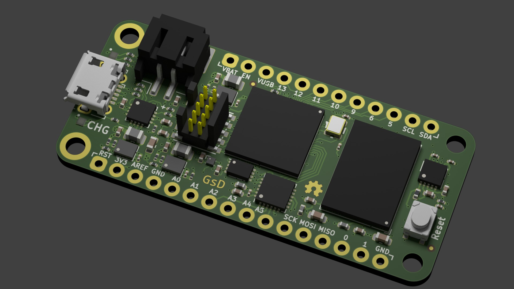

# Orange Crab r0.1

## ECP5 DDR3 memory in a Feather form-factor.

	Hardware r0.1 is not the latest hrdware version. There are some bugs listed below.

## What is it
Project goal: "Make a simple ECP5 breakout board with DDR3L memory". As that was the only design goal I also decide it might be nice to keep the overal size small and make it an adafruit feather compatible dev board.

## Hardware Overview
* Lattice ECP5 25 (With limited support for 45/85 variants)
* DDR3L Memory upto 1Gbit (64Mbit x16)
* Micro USB connection
* Full-speed (12Mbit) USB direct connection to FPGA
* Battery charger, with charge indicator LED
* Reset Button 
* 16Mbit QSPI FLASH Memory (Bitstream + User storage)
* 4bit MicroSD socket
* 48MHz Oscillator (Used by USB system)
* ATSAMD10/11 Co-processor planned mainly for the ADC/DAC
* Spare 3.3V I/O's broken out onto a 30pin low profile connector
  * 7 diff pairs
  * 1 single ended only

## Errata
 1. FLASH footprint only supports devices upto 16Mbit in size, This is enough for a bootloader and user gateware on the 25/45F parts, but not enough for a fully loaded 85F design.
 2. DDR3 traces are quite close, violating the recommended 6mil clearance. Tests appear to indicate this isn't a huge deal on this design.
 3. No firmware was ever written for the SAMD11 co-precessor, so A0-A5 don't do anything.
 4. LED resistor values are not tuned very well, resulting in very bright USB-Present LED.
 5. The button is tied directly to `PROGRAMN` pin on the FPGA, this means pressing the button resets the device. (Which is used to toggle between user/bootloader gateware)

## Licence

 * Hardware in this repository is licenced under CERN OHL v1.2
 * Gateware/Software/Firmware in this repository is licenced under MIT unless otherise indicated

