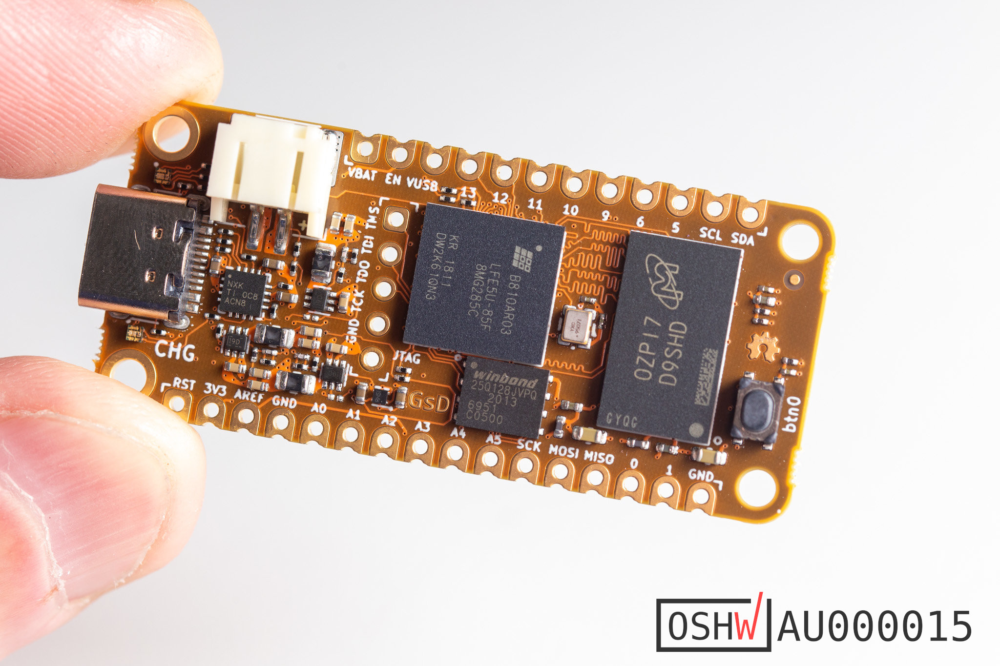

# OrangeCrab r0.2.1
## ECP5 Feather development board.

	Hardware r0.2.1 has run through a production run and available at GroupGets, element14.
    
---

## What is it?
There aren't many OSHW ECP5 boards available. Given that this FPGA is fully supported by an open source toolchain I decided to create one. In order to make use of the DDR3L support the ECP5 has, I've added some DDR3L memory. The board matches the feather format

## Hardware Overview
* Lattice ECP5-25F or ECP5-85F FPGA in csfBGA285 package
    * 24 K - Look Up Tables
    * 1008 Kb - Embedded Block RAM
    * 194 Kb - Distributed RAM
    * 28 - 18x18 Multipliers
    * PLLs: 2
    * Internal oscillator
    * Flexible I/O for DDR3 Memory Support
* DDR3L Memory
    * 128 Mbytes (1Gbit) or 512Mbytes (4Gbit)
    * x16 data width to FPGA
    * 1.35V low voltage operation
* USB-C connection
    * Full-speed (12Mbit) USB with direct connection to FPGA
* Non-volatile Storage
    * 128Mbit QSPI FLASH Memory 
        * Bootloader (First 4Mbits)
        * User Bitstream
        * User storage (Firmware/MSC backend/etc)
        * QSPI compatible
    * MicroSD socket
        * 4bit SD interface (CK, CMD, DAT0-3)
* Power supply
    * High effeciency DCDC for main supplies
    * Battery charger (100mA), with charge indicator LED
    * LiPo battery connector (PH type) (1-cell: 3.7-4.2V)
* 48MHz onboard oscillator
* Accesible 0.1" JTAG breakout
* User I/O
    * 1x Button 
    * 1x RGB LED
    * 20x I/O on 0.1" headers
* Analog System
    * Analog Mux
    * SAR ADC, external RC / input comparator of FPGA
    * Digital bypass
    * Internal channels for supply monitor
    * Battery voltage sensing
* Feather Format Board
    * Dimensions: 22.86mm x 50.8mm (0.9" x 2.0")
    * Castellated I/O edges

---

## Licence

 * Hardware in this repository is licensed under CERN OHL v1.2
 * Gateware/Software/Firmware in this repository is licensed under MIT unless otherwise indicated

 ## Open Source Hardware
This board is an OSHWA approved design: [AU000015](https://certification.oshwa.org/au000015.html)